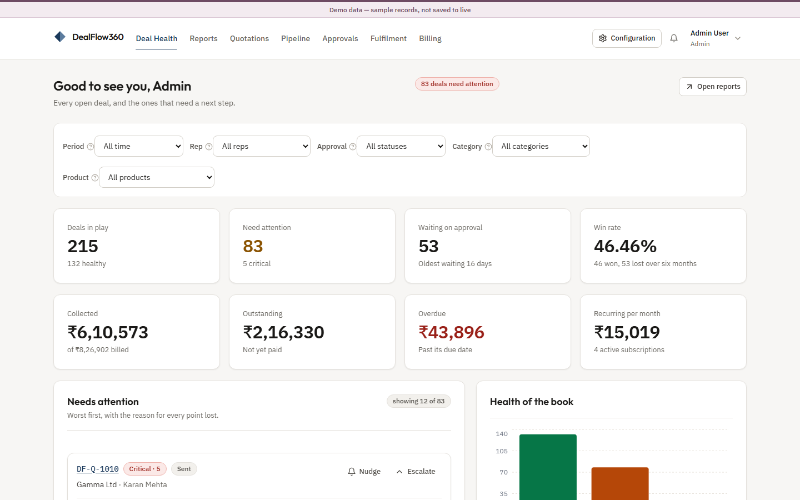
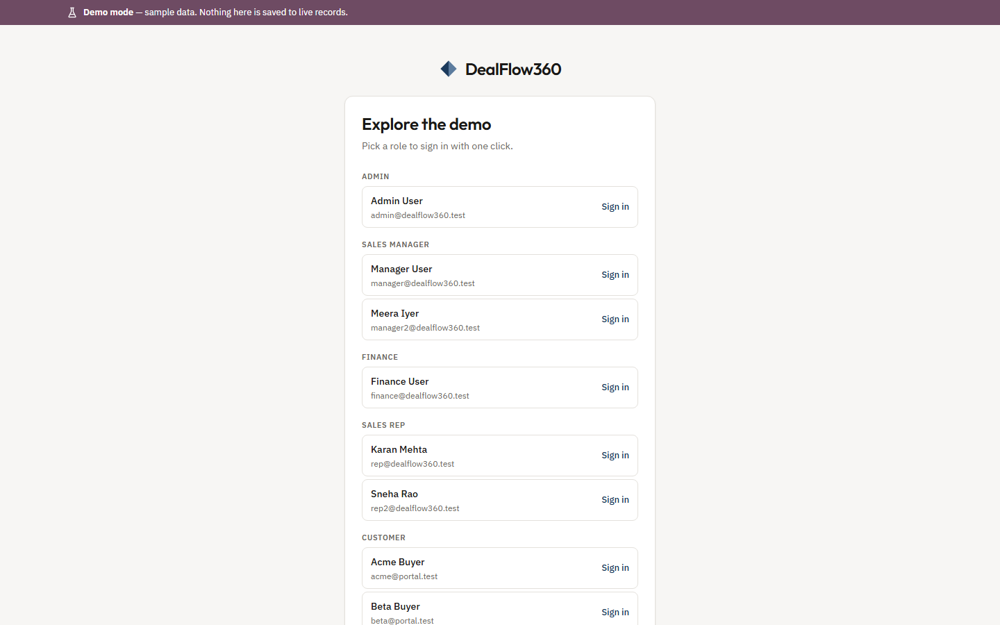
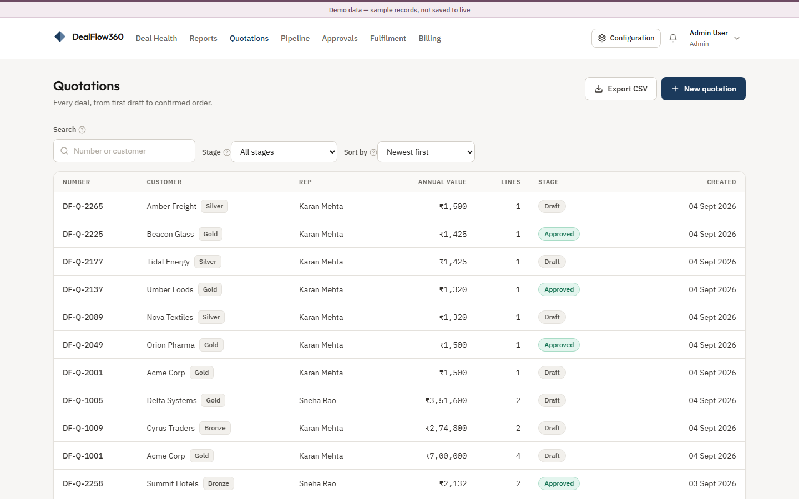
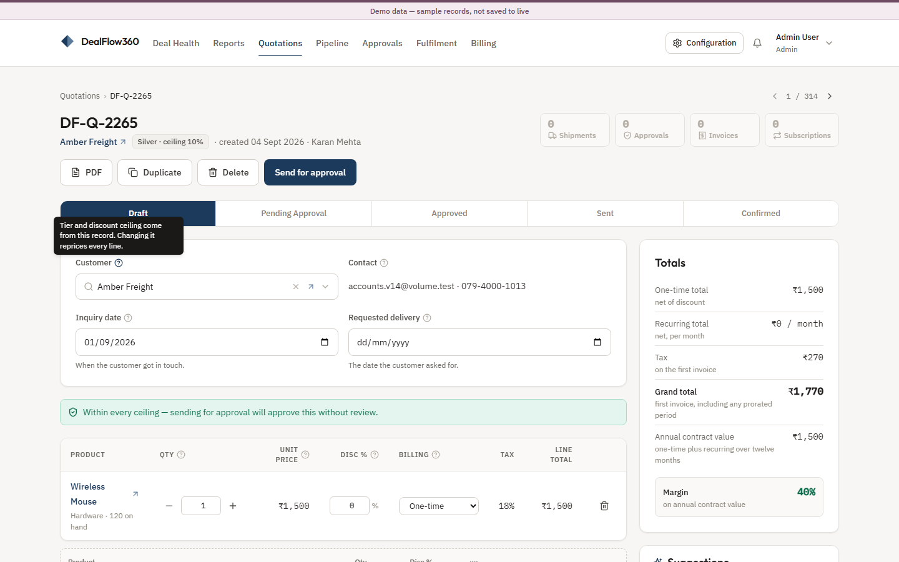
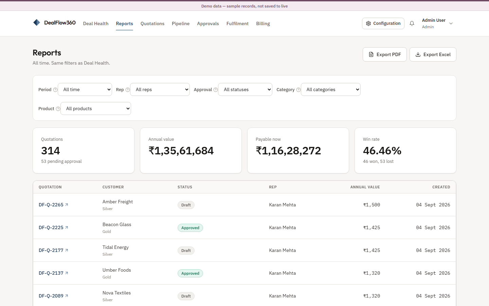
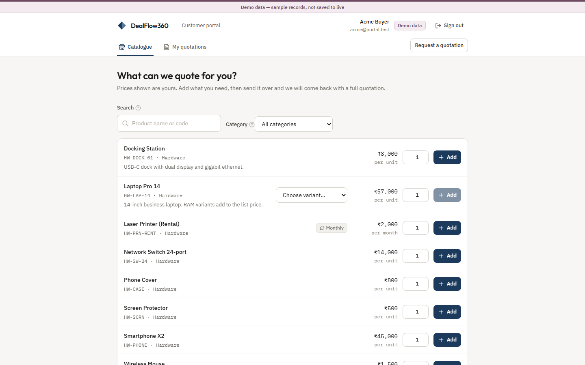

# DealFlow360

Self-governing B2B sales operations — quotation to cash with discount approval routing, multi-warehouse fulfilment, hybrid billing, and a customer portal.

Most sales tools stop at “create a quote, confirm an order, invoice it”. DealFlow360 enforces pricing discipline, reacts to real stock, keeps one-time and recurring lines on a single order, and gives the customer a living document instead of a static PDF.



---

## What it does

- **Quotation builder** — lines, variants, captured unit prices, discount ceilings, blended risk, and approval routing
- **Quote-to-order loop** — the same record moves `Draft → Pending approval → Approved → Sent → Confirmed`; becoming an order does not copy anything
- **Fulfilment** — stockable lines split across warehouses or go to backorder; services skip the warehouse
- **Hybrid billing** — one-time invoices and subscriptions from the same confirmed order, with proration when a period starts mid-cycle
- **Customer portal** — browse the catalogue, request a quotation, approve or decline a sent quote
- **Deal health** — live scores from stall, discount anomaly, delivery slip, approval wait, and customer history
- **Reports** — the same filters as Deal Health, exportable as PDF or Excel
- **Configuration** — company profile, mail / outbox, ceilings, approval bands, price lists, warehouses

Every business rule is enforced on the server. Hiding a button is a convenience, never the control.

---

## Screenshots

### Demo sign-in

One-click accounts for every role. `/demo` uses sample data; `/login` is the live instance.



### Quotations

The full order book — drafts through confirmed orders — with search, stage and sort.



### Quotation builder

Customer, dates, lines and totals. Hover the help mark on a field for what it controls.



### Reports

KPIs and a filterable table. Export PDF or Excel using the filters on screen.



### Customer portal

Tier-priced catalogue. A customer can add lines and send a request; sent quotations appear under **My quotations**.



---

## Stack

| Layer | Choice |
|---|---|
| App | React, Vite, Tailwind, React Router, TanStack Query |
| API | Node, Express, Prisma, SQLite |
| Realtime | Socket.io |
| Auth | JWT + bcrypt |
| Mail | Nodemailer, or an on-screen outbox when SMTP is not set |

One language front to back. SQLite needs no database server, so the app runs on any laptop.

---

## Run it

Requires **Node 18** or newer.

```bash
git clone https://github.com/karm-tech/dealflow360.git
cd dealflow360
npm install
cp .env.example .env          # Windows: copy .env.example .env
npm run setup                 # migrate both databases and load their data
npm run dev                   # API on :4000, app on :5173
```

Open **http://localhost:5173**.

### Admin login

The same admin exists on both instances. Password is **`demo1234`** everywhere.

| | Address | Email | Password |
|---|---|---|---|
| **Demo** (sample data) | http://localhost:5173/demo | `admin@dealflow360.test` | `demo1234` |
| **Live** (empty order book) | http://localhost:5173/login | `admin@dealflow360.test` | `demo1234` |

Other demo roles are listed under [Demo accounts](#demo-accounts).

### Scripts

| Command | What it does |
|---|---|
| `npm run dev` | API and web app together |
| `npm run dev:api` | API only, port 4000 |
| `npm run dev:web` | Web app only, port 5173 |
| `npm run setup` | Generate client, migrate both databases, seed both |
| `npm run migrate:all` | Apply migrations to demo and live |
| `npm run seed` | Reload the demo database |
| `npm run seed:live` | Reset live to master data and one admin |
| `npm run build` | Production build of the frontend |

---

## Demo and live

Each instance has its own sign-in page: **`/login`** for live, **`/demo`** for sample data.

| | **Demo** (`demo.db`) | **Live** (`dev.db`) |
|---|---|---|
| Holds | Catalogue, customers, a full order book | Master data only — empty order book |
| For | Exploring the product | Real work |
| Accounts | The list below | One admin; everyone else requests access |

They are two SQLite files on two connections. **Which one a session uses is inside the signed login token**, so a demo session cannot reach live records by sending a different header.

`npm run setup` is `prisma generate` + `migrate:all` + both seeds. `npm run seed` clears and rewrites demo data only.

### Demo accounts

Every account uses the password **`demo1234`**. Open **/demo** and click a role, or type the credentials.

| Role | Email | Sees |
|---|---|---|
| Admin | `admin@dealflow360.test` | Everything, including configuration |
| Sales Rep | `rep@dealflow360.test` | Quotations, pipeline, fulfilment |
| Sales Rep | `rep2@dealflow360.test` | A second book, so the pipeline is not one person |
| Sales Manager | `manager@dealflow360.test` | Approvals and deal health |
| Finance | `finance@dealflow360.test` | Second-level approvals, billing |
| Customer | `acme@portal.test` | Portal only — Acme’s quotations |

Other portal logins: `beta@portal.test`, `cyrus@portal.test`, `delta@portal.test`, `gamma@portal.test`.

Internal signup files a **pending request with no role and no token**. An admin opens **Access Requests**, picks the role, and approves or declines.

---

## How it is put together

```
src/                     Frontend (React + Vite + Tailwind)
  app/                   Auth state, route guards, realtime
  components/            Layout and shared UI
  features/              One folder per module
  lib/                   API client, formatting, constants
server/                  Backend (Express + Prisma + SQLite)
  src/routes/            One file per resource
  src/middleware/        Login and role guards
  src/lib/               Pricing, risk, fulfilment, billing, health
  prisma/                schema.prisma and seed.js
```

```
Quote ──► Risk + ceilings ──► Approval (if needed) ──► Send
  │                                                      │
  │                                                      ▼
  │                                              Customer portal
  │                                                      │
  └────────────── Confirmed order ◄──────────────────────┘
                         │
            ┌────────────┴────────────┐
            ▼                         ▼
     Warehouse split            Hybrid bill
     / backorder                invoice + subscription
            │                         │
            └────────────┬────────────┘
                         ▼
                   Deal health + reports
```

**A quotation and an order are the same record.** Confirming it changes the status; nothing is copied.

**Billing and fulfilment are two different fields.** `QuotationLine.billingType` says how it is charged. `Product.isStockable` says whether it needs a warehouse. They are independent: a rented printer is recurring *and* stockable; a support plan is neither.

**Routes never import a database client.** They use `req.db`, set from the `db` claim in the login token. That is what keeps demo and live apart.

---

## Environment

Copy `.env.example` to `.env`. The defaults run without internet.

| Variable | Purpose |
|---|---|
| `DATABASE_URL` | Live SQLite file (`dev.db`) |
| `DEMO_DATABASE_URL` | Demo SQLite file (`demo.db`) |
| `JWT_SECRET` | Signs login tokens — change this for anything real |
| `PORT` / `CLIENT_ORIGIN` | API port and trusted browser origin |
| `SMTP_*` / `MAIL_FROM` | Optional. Leave `SMTP_HOST` blank to queue mail in the outbox |

SMTP values in `.env` are the seed defaults. After that, **Mail settings** is what the app reads.
